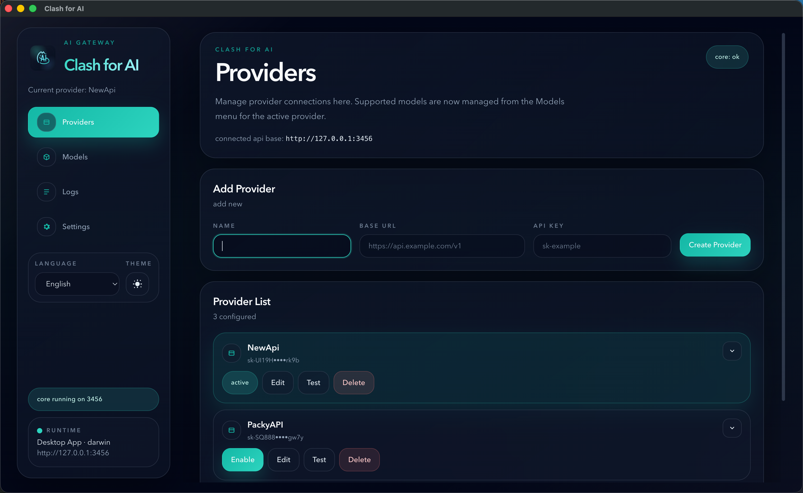
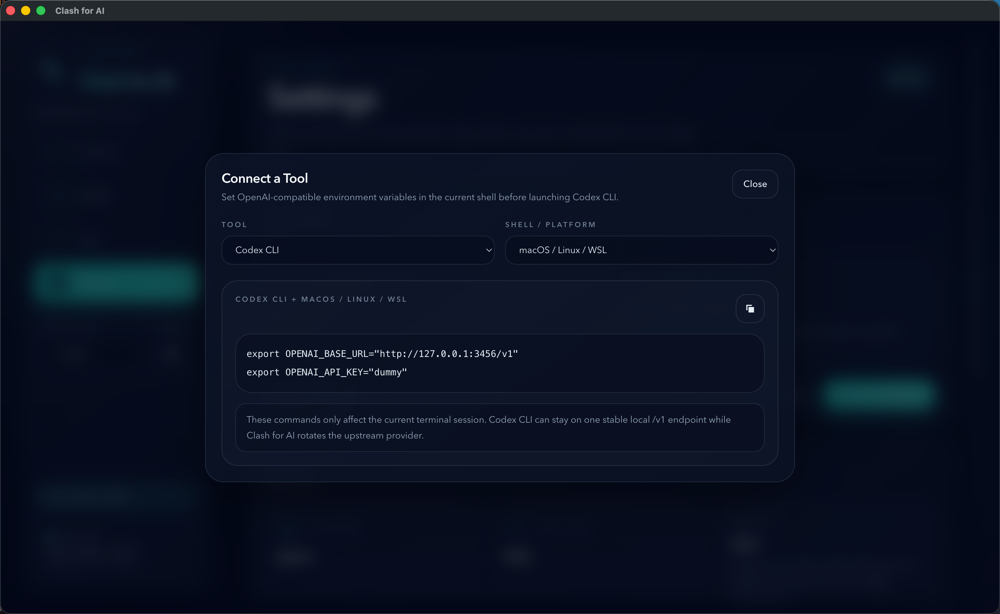
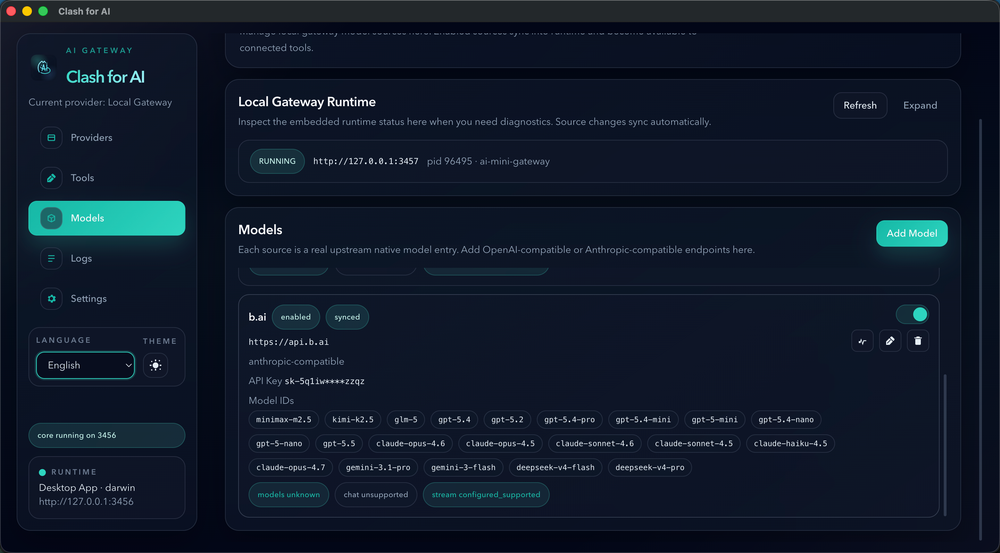
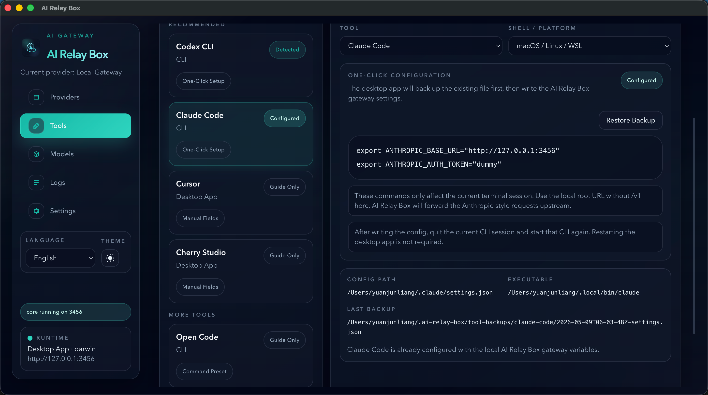
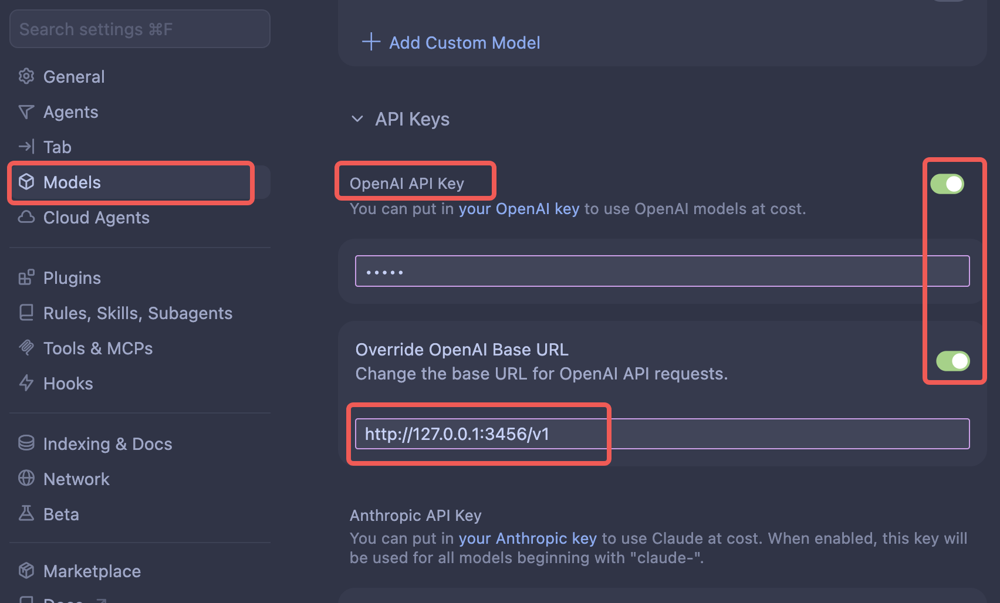

# AI Relay Box

[English README](./README.md) | [中文 README](./README.zh-CN.md)

<a href="https://www.airelaybox.com/" target="_blank" rel="noopener noreferrer">Public Docs</a> | <a href="https://www.airelaybox.com/deep-link-import/" target="_blank" rel="noopener noreferrer">Deep Link Import Guide</a>

AI Relay Box is a local desktop gateway for people who switch between multiple AI gateways or API relay providers.

Its role is:

1. Provide one local API entry point
2. Switch different upstream gateways behind that local entry point
3. Manage providers, health checks, and request logs from a desktop UI

It is not primarily a manager for one specific AI tool. It is better understood as:

1. a local relay gateway for tool traffic
2. a multi-provider control plane
3. a local native-model source manager for upstream models that need their own registry and routing layer

It currently gives you:

1. One stable local endpoint for your tools
2. A desktop control plane for switching providers
3. A local model-source gateway for managing native upstream models
4. Local request logs and health checks for debugging provider issues

## Core Idea

The model is simple:

1. Your tools all point to one local gateway
2. Upstream gateway switching happens in the desktop app
3. Real provider credentials, health status, and request logs stay managed locally

## Screenshot

<p align="center">
  
  
</p>

<p align="center">
  
  
</p>


## What Problem It Solves

AI Relay Box is designed for people who depend on multiple AI gateways in daily use.

It mainly addresses two problems:

1. API relay providers can be unstable, so you may need to switch between different gateways frequently
2. If you use multiple coding tools, chat clients, or SDK scripts, changing providers often means repeatedly updating configuration in each tool

The current version also addresses a third problem:

3. Native model upstreams are harder to manage consistently because they do not always fit the old “one active provider” switching model, so AI Relay Box now includes a dedicated local Models Gateway to register and expose those sources in one place

AI Relay Box puts one local gateway in front of those tools.

You configure a single local endpoint once, then switch the upstream relay provider from the desktop app.

## What It Does

AI Relay Box runs a local API gateway on your machine.

Most editors, chat clients, CLI tools, or custom scripts connect to the local endpoint:

```text
http://127.0.0.1:3456/v1
```

Then AI Relay Box forwards requests to the currently active provider you configured in the desktop app.

In the current version, the local access path is most mature around an OpenAI-compatible local entry point. Anthropic-compatible upstream handling and some Claude-style tool integrations are present, but that part of the stack is still being refined.

This means:

1. You do not need to reconfigure every tool when switching providers
2. Provider credentials stay managed locally in one place
3. You can inspect health status and request logs from the desktop UI

## Desktop Modules

The desktop app is organized into five main modules.

### 1. Providers

The `Providers` page is where you manage the upstream services that the main local gateway can route to.

In the simplest mental model:

1. `Providers` is for managing relay services
2. these are usually remote aggregation or proxy platforms
3. examples include services similar to `new-api`, `one-api`, or `sub2api`

Use it to:

1. Add or edit provider connections
2. Switch the currently active upstream provider
3. Run provider health checks
4. Inspect the models a provider exposes
5. Configure Claude Code model slot mapping for the active provider

So if a user mainly wants to switch between different remote relay providers, `Providers` is the primary page.

### 2. Models

The `Models` page exists for a different problem.

It manages a local gateway that runs on your own machine and exposes native model sources in a unified way. Each entry is a model source that can point to:

1. an OpenAI-compatible upstream
2. an Anthropic-compatible upstream

Use it to:

1. Add local gateway model sources
2. Auto-detect or manually define model IDs
3. Enable or disable model sources
4. Sync those sources into the embedded local gateway runtime

Why this module exists:

1. Many native model upstreams are not best managed as one switched relay provider
2. Different native upstreams expose different model ids and model lists
3. Users may want a local service that behaves more like running a small `new-api` or `sub2api` style gateway on their own machine
4. That local gateway can then expose many native upstream models through one controlled local layer

So the `Models` page introduces a separate local Models Gateway layer. Instead of only switching one active Provider, AI Relay Box can now maintain a set of native model sources locally and expose them through a local compatibility gateway.

In practical terms:

1. `Providers` manages remote relay services and also shows the local Models Gateway as one selectable provider
2. `Models` manages the internal source list that powers that local Models Gateway
3. the local Models Gateway is added into the Provider management list by default, so tools can still treat it as one provider option on the main gateway side

This means the relationship is:

1. `Models` configures the local gateway's native model sources
2. that local gateway becomes one provider option inside `Providers`
3. `Providers` remains the place where the user selects between remote relay services and the local Models Gateway

### 3. Tools

The `Tools` page helps client tools connect to AI Relay Box correctly.

Use it to:

1. Copy ready-to-use local endpoint values
2. Run one-click setup for supported tools such as Codex CLI and Claude Code
3. Follow guided setup for tools like Cursor, Cherry Studio, and SDK scripts

### 4. Logs

The `Logs` page shows request history flowing through the local gateway.

Use it to:

1. Inspect recent requests
2. See provider, model, path, and latency information
3. Read failures when an upstream provider behaves incorrectly

### 5. Settings

The `Settings` page is the system control area for the desktop app itself.

Use it to:

1. View runtime status
2. Adjust local ports
3. Check for desktop updates
4. Control launch and tray behavior
   - Launch at login
   - Launch hidden
   - Close to tray


## Quick Start

If you do not want to read the full guide yet, use one of these quick setup patterns.

## WSL / Linux Server

If you want to deploy AI Relay Box on `WSL` or a plain `Linux server` instead of using the desktop app:

```bash
curl -fsSL https://raw.githubusercontent.com/xiaoyuandev/ai-relay-box/main/scripts/install.sh | bash
```

After installation, the default endpoints are:

1. Web management UI: `http://127.0.0.1:3456`
2. OpenAI-compatible local endpoint: `http://127.0.0.1:3456/v1`

Production installer:

1. `scripts/install.sh` downloads the latest stable GitHub Release assets.
2. `scripts/install-from-source.sh` is only for development, local validation, or unreleased branches.

Full guide:

- [WSL / Linux Server Deployment Guide](./docs/wsl-linux-server-guide.zh-CN.md)
- [WSL / Linux Server Deployment Guide (English)](./docs/wsl-linux-server-guide.md)

### 1. Add a provider in AI Relay Box

Open the `Providers` page in the desktop app and fill in:

1. `Name`
2. `Base URL`
3. `API Key`

For OpenAI-compatible relay providers, the Base URL usually ends with `/v1`.

For other compatible APIs, whether `/v1` should be included depends on the upstream implementation. At the moment, OpenAI-compatible upstreams are the clearest and most mature path in AI Relay Box.

<p align="center">
  
</p>

### 2. Point your tool to the local endpoint

In most supported tools, configure:

```text
Base URL: http://127.0.0.1:3456/v1
API Key: dummy
```

If the local app selects another port at runtime, use the actual `connected api base` shown in the desktop UI.

### 3. Use the `Tools` page when you need tool-specific setup

The `Tools` page provides:

1. Copy-ready connection values
2. One-click setup for Codex CLI and Claude Code
3. Setup guidance for tools such as Cursor, Cherry Studio, and SDK scripts

### CLI Tools

For OpenAI-compatible CLI tools such as Codex CLI, set environment variables in the current shell before launching the tool:

```bash
export OPENAI_BASE_URL="http://127.0.0.1:3456/v1"
export OPENAI_API_KEY="dummy"
```

Then start the CLI from the same terminal session.

For Claude Code style tools, AI Relay Box currently provides an Anthropic-style environment variable setup flow:

```bash
export ANTHROPIC_BASE_URL="http://127.0.0.1:3456"
export ANTHROPIC_AUTH_TOKEN="dummy"
```

Inside AI Relay Box, you can also open the `Tools` page and use the built-in one-click setup flow for supported CLIs.

One clarification: the most stable local access path in the current release is still the OpenAI-compatible one. Anthropic-style local access and upstream compatibility are still being improved. If your tool also supports a custom OpenAI-compatible endpoint, prefer `http://127.0.0.1:3456/v1`.

### IDEs And Plugins

For IDEs, editor plugins, and desktop chat clients, open the provider settings and fill in:

```text
Base URL: http://127.0.0.1:3456/v1
API Key: dummy
```

Inside AI Relay Box, open the `Tools` page to find the recommended connection values for supported tools.

<p align="center">
  
  
</p>

For tools like Cursor or Cherry Studio, if there is a provider type or protocol field, choose an OpenAI-compatible custom provider mode first, then paste the values above.

In Cursor specifically, open its custom provider settings, choose an OpenAI-compatible provider mode, then fill in the local Base URL and `dummy` API key.

<p align="center">
  
</p>

### SDK Scripts And Local Apps

If you want to interact with the currently active model provider from your own scripts, point your SDK or HTTP client to the local AI Relay Box gateway instead of the upstream relay directly.

Example with the OpenAI SDK:

```ts
import OpenAI from "openai";

const client = new OpenAI({
  apiKey: "dummy",
  baseURL: "http://127.0.0.1:3456/v1"
});

const response = await client.responses.create({
  model: "gpt-4.1",
  input: "Say hello from AI Relay Box."
});

console.log(response.output_text);
```

You can do the same thing with plain HTTP requests:

```bash
curl http://127.0.0.1:3456/v1/chat/completions \
  -H "Content-Type: application/json" \
  -H "Authorization: Bearer dummy" \
  -d '{
    "model": "gpt-4.1",
    "messages": [
      { "role": "user", "content": "Say hello from AI Relay Box." }
    ]
  }'
```

The actual model that responds still depends on the model name your script sends and on which provider is currently active in the desktop app.

## Documentation

If you want fuller step-by-step guidance, tool-specific examples, and troubleshooting notes, continue with:

- [User Guide](./docs/user-guide.md)
- [WSL / Linux Server Deployment Guide](./docs/wsl-linux-server-guide.zh-CN.md)
- [WSL / Linux Server Deployment Guide (English)](./docs/wsl-linux-server-guide.md)
- [中文 README](./README.zh-CN.md)

If you are deploying on `WSL` or `Linux server`, prefer the server guide first. It also includes pinned release installation using `AI_RELAY_BOX_VERSION`.

## How To Read Protocol Support Today

In practice, many upstream gateways expose both OpenAI-compatible and Anthropic-compatible APIs.

AI Relay Box is designed around those two compatibility families, but the current implementation is not equally mature in both directions:

1. OpenAI-compatible local access is the clearest and most stable primary path
2. Anthropic-compatible upstream auth handling and some tool integrations are already covered
3. Full Anthropic-style local protocol coverage is still being improved

Because of that, for tools that let you choose a custom OpenAI-compatible endpoint, that path is currently the safest default.

## About Model Lists

Provider model list fetching exists, but it should be understood as a compatibility feature rather than a guaranteed capability of every upstream.

Common reasons include:

1. Different gateways expose model list endpoints differently
2. Some upstreams do not expose a standard model list endpoint at all
3. Returned JSON payloads may vary

So a provider can still be usable for request forwarding even if its model list is incomplete or unavailable.

## FAQ

### Why does macOS show “the developer cannot be verified” on first install?

Current public macOS builds may still show a Gatekeeper warning on first install or first launch because the project is currently distributed with a free ad-hoc style signing path instead of a fully trusted paid Apple distribution chain for every released artifact.

That is why users may see messages like:

```text
“AI Relay Box” cannot be opened because the developer cannot be verified.
```

or:

```text
“AI Relay Box” cannot be opened because Apple cannot verify it for malicious software.
```

If this happens, the user should do this:

1. Move the app into `/Applications` if it is still inside a temporary download folder
2. In Finder, right click `AI Relay Box.app`
3. Choose `Open`
4. In the system confirmation dialog, choose `Open` again

If the `Open` action still does not appear, use:

1. `System Settings`
2. `Privacy & Security`
3. Scroll to the security warning area for AI Relay Box
4. Click `Open Anyway`

After the first successful open, later launches normally stop showing the same warning.

If a `.pkg` installer is attached to the release, prefer the `.pkg` build over dragging a raw `.app` bundle manually.

## Local Development

Requirements:

1. Node.js
2. pnpm
3. Go toolchain, if you want the core service to build locally

Install dependencies:

```bash
pnpm install
```

Run the desktop app in development mode:

```bash
pnpm dev
```

Build the desktop app:

```bash
pnpm build
```

Build packaged desktop releases:

```bash
pnpm --filter desktop build:mac
pnpm --filter desktop build:win
pnpm --filter desktop build:linux
```

Sync the bundled `ai-mini-gateway` runtime version before packaging when a new upstream release is available:

```bash
pnpm --filter desktop update:ai-mini-gateway-runtime
pnpm --filter desktop update:ai-mini-gateway-runtime v0.1.1
pnpm --filter desktop update:ai-mini-gateway-runtime v0.1.1 --prepare
```

Use the default command to track the latest release, or pass an explicit version to pin a specific tag. Add `--prepare` to also refresh the local bundled runtime binary and version metadata.

## Project Structure

```text
apps/desktop   Electron desktop application
core/          Go local gateway and provider management backend
docs/          Public user-facing documentation
```

## License

This project is licensed under the GNU Affero General Public License v3.0 only.

See:

- [LICENSE](./LICENSE)

## Brand Notice

The source code in this repository is licensed under AGPL-3.0-only.

However:

1. The project name `AI Relay Box`
2. Logos
3. Icons
4. Other brand assets

are not granted for unrestricted use by this source license unless explicitly stated otherwise.

## Status

This project is under active development. Interfaces, packaging flow, and update behavior may still change.
